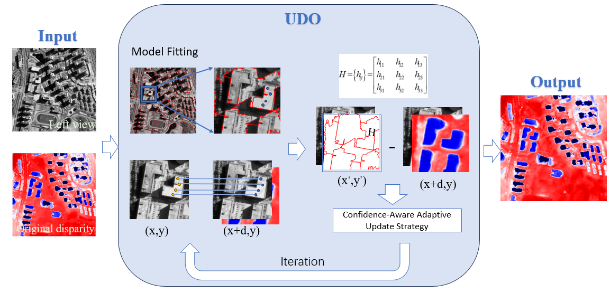
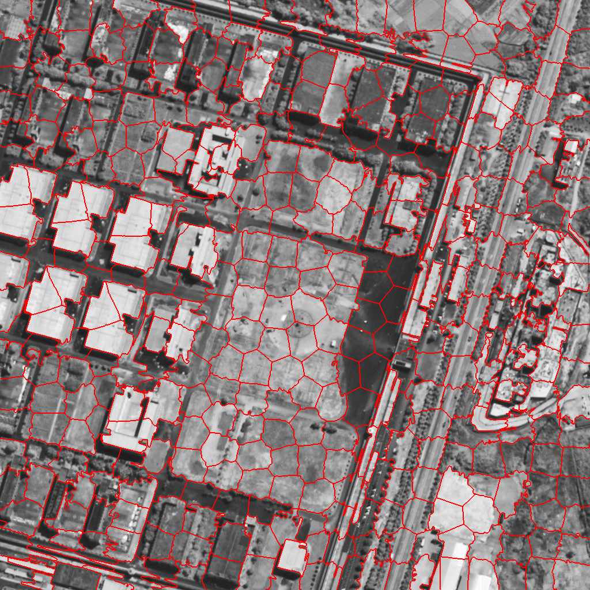

# UDO

Code for paper "Optimising Urban Satellite Disparity Estimation via Unsupervised Local Geometric Constraints".


# Environment

* cv2
* GDAL
* h5py
* numpy
* tqdm
* subprocess
* matplotlib

# Usage

#### Preparing for superpixel segmentation

In this step you will get a mat file with superpixel segmentation results and a preview of the results.

```
python Superpixel/main.py --left_img <left>.tiff --disp_img <disp>.tiff --name <name>
```

#### Segmentation result example

Superpixel segmentation display



#### Optimising

In this step, the disparity value of each superpixel area will be iteratively optimized according to the superpixel segmentation results.

```
python Train.py
```

